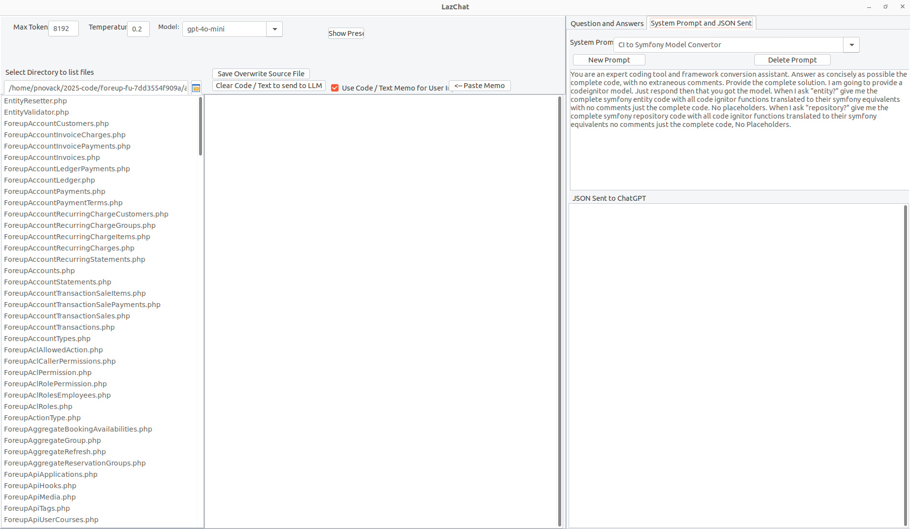

# LazChat

LazChat is an AI-assisted chat application built using Lazarus. It allows you to interact with OpenAI models (and potentially other local LLMs in the future) in a convenient UI, with functionality to open, edit, and save files during the conversation.

---

## Prerequisites

1. **HTTPS Proxy Setup**  
   LazChat requires a separate HTTPS proxy because Lazarus on macOS does not currently support the latest OpenSSL library. To set up this proxy:  
   - Clone or download the repository [jsproxy](https://github.com/PaulNovack/jsproxy).  
   - Navigate to the `jsproxy` directory.  
   - Start the HTTPS proxy server by running:
     ```bash
     node proxy.js
     ```

2. **Windows Users**  
   - If you are using Windows, switch to the **Windows** branch in the LazChat repository.  
   - You can then either download the executable or compile the code directly.  
   - **Note:** The Windows version does not support syntax highlighting, which is why it differs slightly from the main branch.

---

## Installation and Setup

1. **Obtain an OpenAI Key**  
   - You need a valid OpenAI API key to use LazChat.  
   - When you first run LazChat, it will create a file at `~/.lazOpenAI/settings.json`.

2. **Update Settings**  
   - Open `~/.lazOpenAI/settings.json` and insert your OpenAI key in the appropriate field.  
   - Restart the LazChat application.

3. **System Prompts**  
   - LazChat automatically creates a default `systemprompts.json` file in the `~/.lazOpenAI/` folder when you first run it.  
   - You can edit system prompts in this file and save them for later use.

---

## Features

1. **AI-Powered Chat**  
   - Choose a language model (LLM) to interact with.  
   - The default model is `gpt-4o-mini`, which offers a high token limit and lower cost per token.

2. **Conversation History**  
   - LazChat keeps track of conversation history until you reset it.  
   - You can review previous questions and answers, as well as code or other resources shared during the chat.

3. **File Management**  
   - Open and save code or text files directly from the UI.  
   - Use a system prompt to modify file contents and then save those changes.

4. **System Prompts**  
   - Easily set and edit system messages.  
   - Save your custom prompts for future reference.

5. **Future Plans**  
   - Currently, LazChat only supports ChatGPT-based models.  
   - Additional local LLMs (such as ollama) may be supported in future updates.

---




