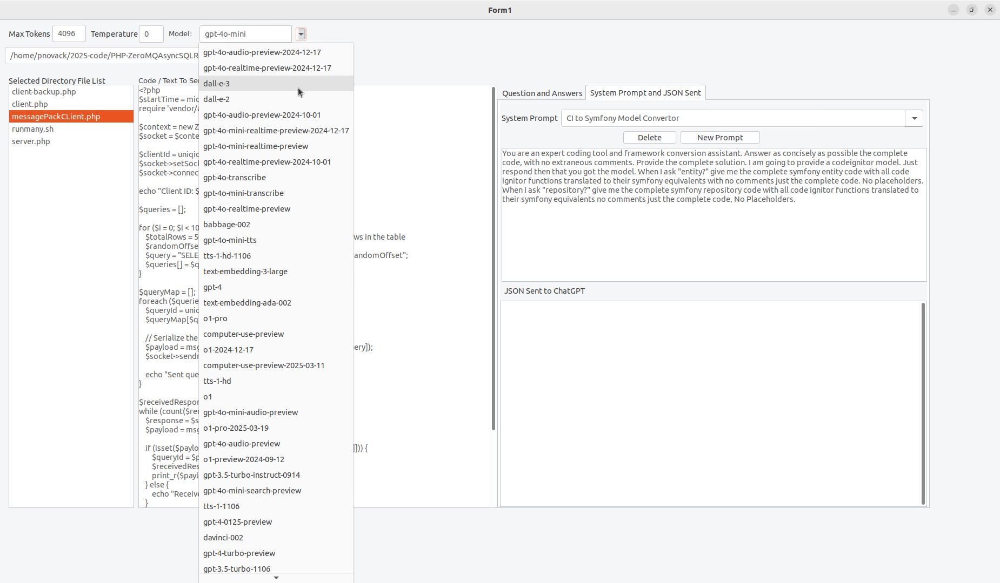
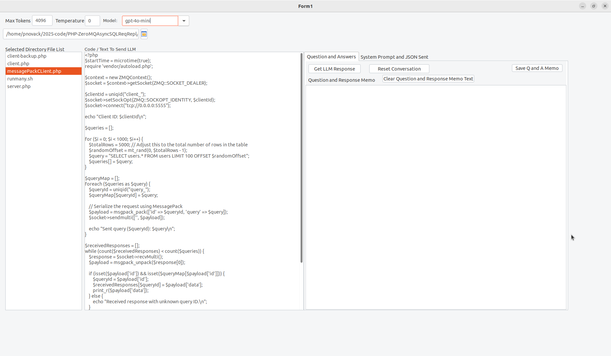

# LazChat

To run this application you must first checkout https://github.com/PaulNovack/jsproxy and then start the https proxy server
<pre>
  node proxy.js     
</pre>

I am using a http to https proxy because Lazarus does not support the very latest OpenSSL library that is installed on Mac OS.

## Running the Application LazChat

You will need to add your OpenAI key to the ~./lazOpenAI/settings.json file the application with create the file when you first run it.

Fill out the settings.json and then restart the application.

## The application provides the following functionality

A chat interface that allows opening and saving of files.

Allows you to choose a LLM.

Allows you to set a system message.

Keeps history of questions and code or other resources in conversation till reset.

Currently only works using ChatGPT may add ollama and some other LLM's in the future

